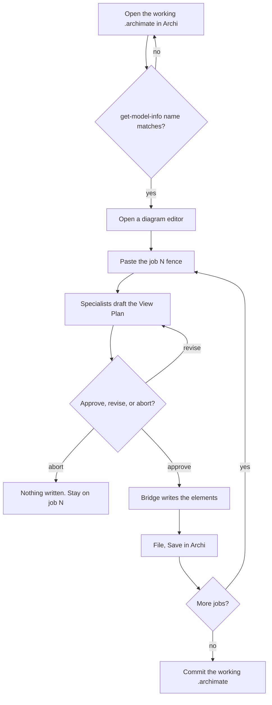

<!-- Copyright (c) 2026 JG Systems Consulting Ltd. See LICENSE. -->
<!-- SPDX-License-Identifier: MIT -->

# How to run

This checkout holds models and sequenced pastes. The skill pack is
[jgs-archi-skills](https://github.com/jgsystemsconsulting/jgs-archi-skills).
The plugin is [jgs-archi-mcp](https://github.com/jgsystemsconsulting/jgs-archi-mcp).
Do not copy those into this repo.

Two tracks. Looking at a finished model does not need an agent. Replaying a
job does.

## Look at the mill

1. Install Archi 5.7+.
2. Open `models/hatherley-plate.archimate`. The model name is **Hatherley
   Plate Ltd**.
3. Open the five views under Views. Freeze: OrderSight and MillOS stay
   separate; rolling equipment sits on the mill-floor node; no work packages.

Moorfield: open `models/moorfield-range.archimate` (**Hawker Range Systems
Ltd**). Freeze: RangePlan, AirStack, and GroundOS stay separate; launch
equipment sits on the range-floor node. Do not treat the range model as a
SysML airframe.

Do not open a `.seed.archimate` file unless you are wiping a failed replay.

## Replay a job

Needs the skill pack and a running JGS Archi Bridge
(`http://127.0.0.1:18090/mcp`).

1. Open the working model for that example. Confirm the Bridge
   `get-model-info` name matches. Do not mutate Hatherley while Moorfield is
   the job, or the reverse.
2. Open a diagram editor (even an empty view) before the first mutate.
   Otherwise the Bridge returns `MUTATION_FAILED` on the UI thread.
3. If that error still appears: MCP Server, Stop, then Start.
4. Paste one fence from `prompts/` or `prompts/moorfield/`. Copy only the
   fenced block. Approve, revise, or abort the View Plan. Nothing is written
   until yes.
5. After a passed job: File, Save in Archi, then commit the working
   `.archimate`. The Bridge has no save tool. Closing Archi without Save
   loses the run.
6. Add a row to `prompts/record.md` or `prompts/moorfield/record.md`.

Do not paste job N+1 until job N passed. A refused View Plan stays on that
job.

The replay loop, end to end:



## Refuse

If the agent invents WMS, TMS, a data lake, an ERP replacement, work
packages, a second site, an air-vehicle product structure, or draws the
planning tool as the mill MES / GCS / airborne computer: refuse, log
`defects/log.md`, re-paste the same job with "do not add X."

## Reset

A reset copies the empty seed over the working model. Every job is gone
afterwards; replay restarts at job 01.

1. Close Archi, or at least close the model (right-click it in the Models
   tree, Close Model). Do not save the failed run.
2. From the repo root, copy the matching seed over the working file.

   Mill:

   ```bash
   cp models/hatherley-plate.seed.archimate models/hatherley-plate.archimate
   ```

   Range:

   ```bash
   cp models/moorfield-range.seed.archimate models/moorfield-range.archimate
   ```

   PowerShell: `Copy-Item <seed> <working> -Force` with the same two paths.
3. Open the working file (`models/hatherley-plate.archimate` or
   `models/moorfield-range.archimate`), not the seed.
4. Confirm the Bridge `get-model-info` name before the first paste:
   **Hatherley Plate Ltd** for the mill, **Hawker Range Systems Ltd** for the
   range.
5. Replay from job 01 under Replay a job.

Windows locks an `.archimate` file that Archi has open, and the copy then
fails. That is why step 1 closes Archi or the model first.

To undo a reset before committing: `git restore` the working file.
